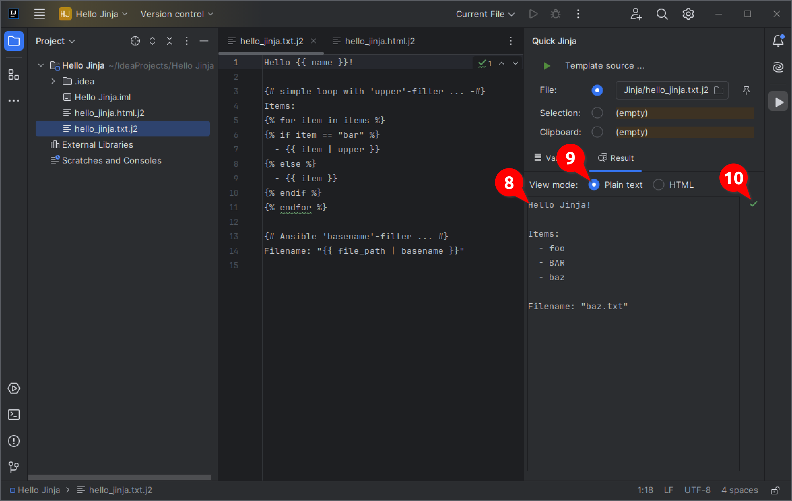

#   IntelliJ Quick Jinja

> A plugin for the IntelliJ platform to quickly render and review Jinja templates.

* [Screenshots](#screenshots)
* [Requirements](#requirements)
* [Installation](#installation)
* [Setup](#setup)
* [Usage](#usage)
* [License](#license)
* [Credits](#credits)
* [Donate](#donate) :heart:

## Screenshots

#### Provide sample variables in a dedicated editor


#### View the rendered result in either plaintext or HTML mode


#### Quickly choose the source of the template (file, selected text, clipboard)


## Requirements

```diff
- A Python interpreter has to be installed on your system. -
```

The `Jinja2` package is also **mandatory**:

* [Jinja2](https://pypi.org/project/Jinja2/)

```bash
pip3 install Jinja2
```

_Quick Jinja_ will try to load and use [Ansible](https://www.ansible.com/)-specific filters.  
So this package is **optional**:

* [Ansible](https://pypi.org/project/ansible/)  

```bash
pip3 install ansible
```
(NOTE: `ansible` already includes the `Jinja2` package)

## Installation

Use the IDE's built-in plugin system:

* `File` --> `Settings...` --> `Plugins` --> `Marketplace`
* search for: `Quick Jinja`
* click the `Install`-button

Or go to the [plugin page](https://plugins.jetbrains.com/plugin/24850-quick-jinja) on the [JetBrains](https://www.jetbrains.com)-website, download the archive-file and install manually.

## Setup

Before actually using _Quick Jinja_ you should check/test your Python environment by using the plugin's settings page:


The plugin **does not** detect or use any (virtual) environment settings of your current project.
However, you can use an individual script/executable that does the necessary/individual preparations. 

Example:

* create a `quick-jinja` folder in your home directory:
  ```bash
  mkdir ~/quick-jinja
  ```

* change into it, and create a dedicated virtual environment:
  ```bash
  cd ~/quick-jinja
  python3 -m venv venv
  ```

* activate the virtual environment and install `Ansible` via `pip`:
  ```bash
  source venv/bin/activate
  pip install ansible
  ```

* finally, create this script file (`~/quick-jinja/run.sh`):
  ```bash
  #!/bin/bash
  source ~/quick-jinja/venv/bin/activate
  python3 "${@}"
  ```

* don't forget to make it executable:
  ```bash
  chmod +x ~/quick-jinja/run.sh
  ```

Reference this script in the plugin; and you should be ready to go. :thumbsup:

## Usage

Everything should be pretty self-explanatory.  
Here's a detailed description anyway. :grinning:


1. Simply open and use the new tool window to render a _Jinja_ template.
2. Choose the template source:
   - the complete contents of the currently edited file (automatically changes when switching tabs) 
   - just the selected text from the currently opened editor
   - the contents of your clipboard
3. You can use the pin icon to disable automatic file selection and keep the currently opened document as template-source.
4. Enter all variables (needed for rendering) in the variables tab.  
Both _JSON_ and _YAML_ definitions are allowed.
5. The status icon on the right will indicate if parsing of the entered variables was successful.
6. Alternatively you can choose any file where variables should be loaded from.
7. Pressing the green run button will try to render the template and switch to the result tab.



8. The rendered template (or any errors) will be shown there.
9. Choose the view mode:
   - Plain text
   - HTML (which should be more suitable when rendering HTML-templates)
10. The dedicated status icon will also indicate if the rendering process successfully finished.

## License

Please read the [license](LICENSE) file.

## Credits

* [Braces](https://icons.getbootstrap.com/icons/braces/) icon / [Play](https://icons.getbootstrap.com/icons/play-fill/) icon - [Bootstrap](https://icons.getbootstrap.com/)
* [Heart](https://fontawesome.com/icons/heart?s=solid&f=classic) icon - [FontAwesome](https://fontawesome.com/)

## Donate

If you like this plugin, please consider a [donation](https://paypal.me/AchimSeufert). Thank you!
